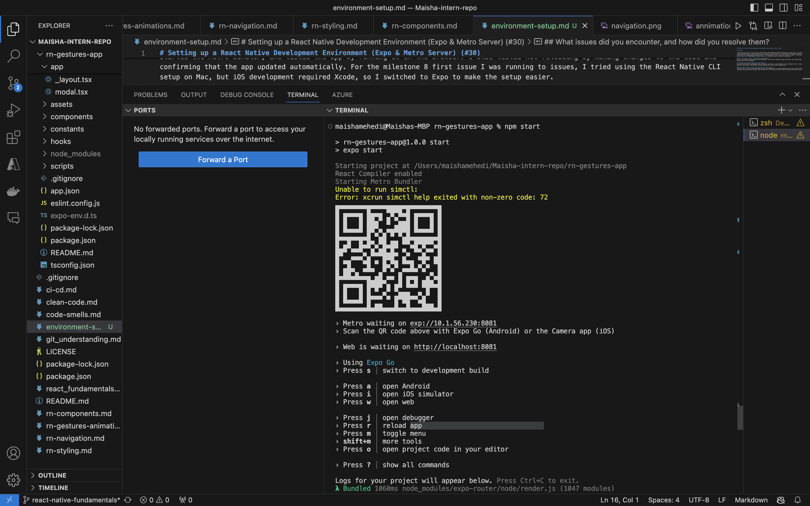
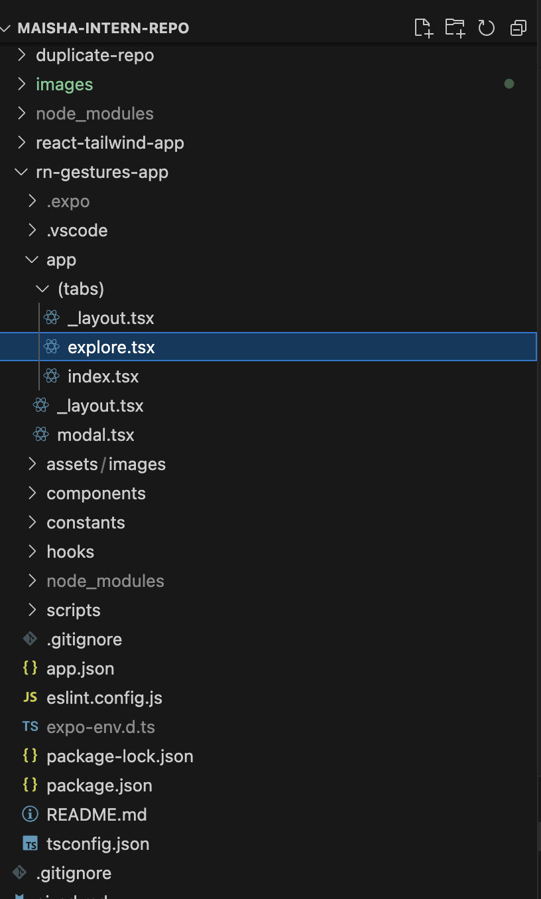

# Setting up a React Native Development Environment (Expo & Metro Server) (#30)

# Summary

In the previous tasks, I already set up a React Native development environment using Expo and Metro Server. I created a new Expo project, started the Metro bundler, and tested the app by running it in the browser. I also tested hot reloading by making changes to the code and confirming that the app updated automatically. For the milestone 8 first issue I was running to issues, I tried using the React Native CLI setup on Mac, but iOS development required Xcode, so I switched to Expo to make the setup easier.

## What is the role of Metro in React Native development?
Metro is the bundler used in React Native development. It builds the JavaScript code and assets, serves them during development, and updates the app when files are changed.

## How does Expo simplify React Native development?
Expo makes React Native development easier by reducing the amount of setup needed. It lets developers start a project quickly, run it with Expo Go or the browser, and use Metro without dealing with as much native configuration.

## What issues did you encounter, and how did you resolve them?
The main issue I faced was that React Native CLI on Mac needed Xcode for iOS development, which I did not have installed. I solved this by creating a new Expo project instead, which allowed me to run the app, use Metro, and continue testing without the same setup problem.

# Proof 

Shows the terminal run 

 
Shows that rn-gestures-app exsits in the repo 
