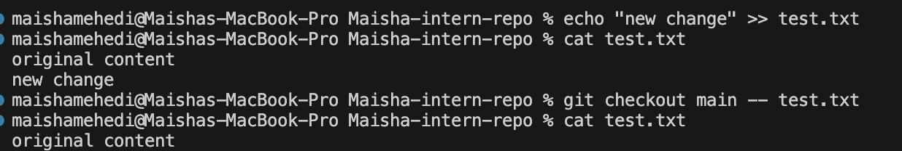
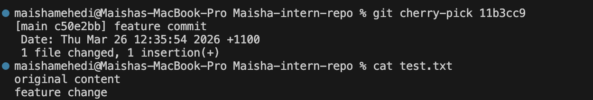
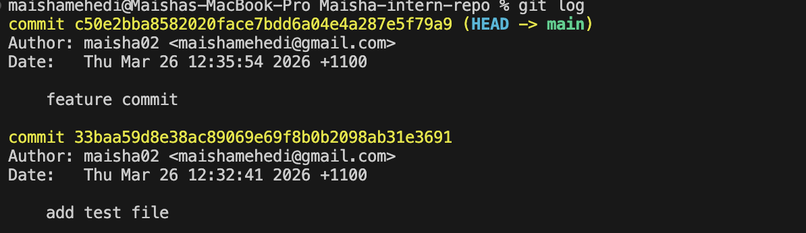
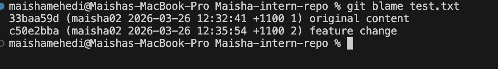

What caused the conflict?
The conflict occured as I changed the same line in the same file on two different branches (main and conflict-branch),which would lead to an issue as Git could not choose which change to go with.

How did I resolve it?
Firstly, I opened the conflicted file, checked both the versions, and decided to go with the final text I wanted. I then removed the conflict markers and saved the file. Lastly, I committed the merge in GitHub Desktop.

What did I learn?
I learned, a conflict can occur when changes overlap in the same part of the file. I also learned how to read the conflict markers and fix the file by choosing version i want.

TASK [Merge Conflicts & Conflict Resolution #40]

What is the difference between staging and committing?
Staging means choosing a file that contain changes to be included in the next commit. When a file is staged using `git add`, Git marks that version of the file to be saved.
Committing means permanently saving the staged changes into the repo history using `git commit`.

Why does Git separate these two steps?
Git separates staging and committing so that we can control what changes to be included in a commit. This helps to create a cleaner  commit instead of saving every change at once.

When would you stage changes without committing?
We do this when we want to review the changes before committing, or when we want to group related changes together before creating a commit.

Branching & Team Collaboration

Why is pushing directly to main problematic?
Pushing directly to the main branch can be very risky because changes go straight into the main codebase without a chance to review it. If the code contains bugs or breaks something, it would affect everyone's work in the repository.

How do branches help with reviewing code?
Branches allow us to work on changes separately from the main branch. The changes can then be reviewed by pull requests before being merged, this ensures mistakes do not happen and improves code quality.

What happens if two people edit the same file on different branches? Git would then try to merge the changes automatically. However if both people modify the same part of the file, a merge conflict would occur and someone would have to manually decide which change to keep.

# Advanced Git Commands & When to Use Them #43

### git checkout main -- <file>
I tested this by modifying a file (git_understanding.md), then restoring it using this command.

Command used:
git checkout main -- git_understanding.md

Result:
The file returned to the version from main and my changes were removed.

Screenshot:

### git cherry-pick <commit>
I created a new branch, made a commit, and then cherry-picked that commit into main.

Command used:
git cherry-pick <commit-id>

Result:
The specific commit was added to main without merging the whole branch.

Screenshot:

### git log
I used git log to view commit history.

Command used:
git log

Result:
It showed all commits with messages, authors, and timestamps. I could track changes clearly.

Screenshot:

### git blame <file>
I used git blame on git_understanding.md.

Command used:
git blame git_understanding.md

Result:
It showed who last edited each line and when.

Screenshot:

### What surprised me
I was surprised that cherry-pick allows copying only one commit instead of merging everything. Also, git blame clearly shows who changed each line, which is very useful in team projects.

------

Understand git bisect #44

What does git bisect do?
we use bisect to find the first commit that introduced the bug, and we do this by testing commits using a binary search.

When would you use it in a real-world debugging situation?
In real-world, projects usually conatins multiple commint, we use bisect when we can not identify what caused a certain bug.

How does it compare to manually reviewing commits?
It uses binanry search, it cuts the search into half as it continues to look for the bug. 

Writing Meaningful Commit Messages #45

What makes a good commit message?
A good commit message clearly mentions what was the change/commit about, while keeping it short and precise. 

How does it help collaboration?
It helps the teammates to understand or review the changes in git log, and is greatly appreciated when debugging.

How can poor messages cause issues later?
Vague message leads to waste of time, as developers struggle to understand what caused an issue or even while reviewing. It makes it harder to find the right change. 