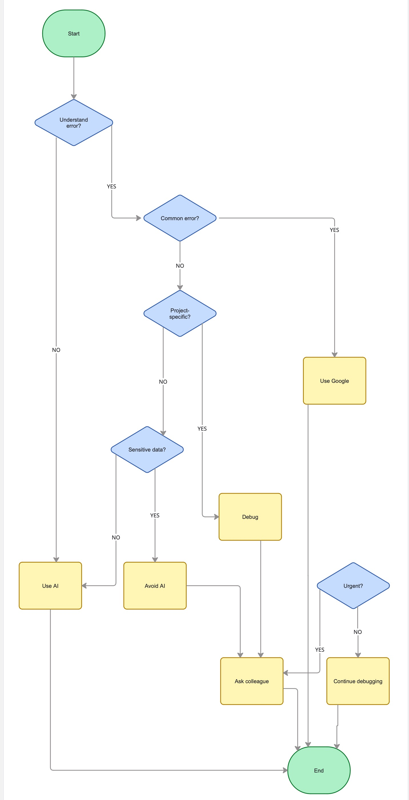

When you get stuck - what next? #58

Tasks 

## Spend 30 mins with ChatGPT
AI tools like ChatGPT are useful for:
- Explaining error messages
- Suggesting fixes
- Providing example code

However, AI is less helpful when:
- The issue is very specific to the project
- There is missing context or logs
- The problem is environment-related

## Develop a decision-making framework

Reflection

## When do you prefer using AI vs. searching Google?
I prefer using AI tools when I need quick explanations or when I don’t understand an error. AI helps break down problems and gives example solutions.

I use Google when the issue is common or when I want to see real solutions from developers, such as Stack Overflow answers or official documentation.

## How do you decide when to ask a colleague?
I ask a colleague when:
- The problem is specific to the project
- I have already tried AI and Google
- The issue is urgent
- Sensitive data is involved

## What challenges do developers face when troubleshooting alone?
Developers may struggle with:
- Not understanding error messages
- Spending too much time searching for solutions
- Getting stuck on small issues
- Missing important context about the project

This can slow down progress and make debugging frustrating.