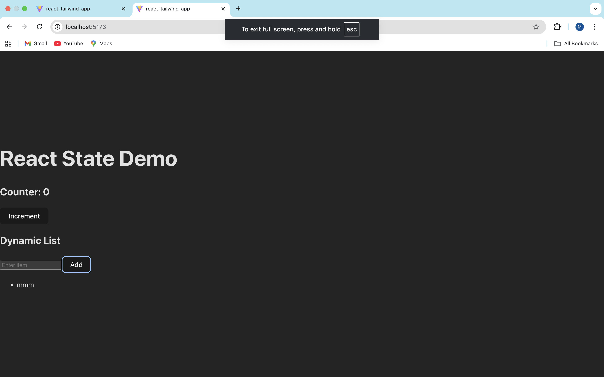

# Understanding Components & Props (60)

Components are the building blocks of React applications. They allow developers to split the UI into small, reusable pieces. Each component manages its own structure and logic. Props allow data to be passed from one component to another. This makes components dynamic and reusable across different parts of the application.

-----

# Handling State & User Input #61
If we modify state directly instead of using the setter function from useState, React will not detect the change. Because of this, the component will not re-render and the UI will not update. Using the setter function ensures React tracks the state change and updates the interface correctly.

## Screenshot of the webpage

------

# Working with Lists & User Input (#62) 
One common issue when working with lists in React is forgetting to add a unique key for each list item. Without a key, React cannot efficiently track which items have changed. Another issue is directly mutating state instead of creating a new array when updating the list. React requires state updates to create a new copy so it can detect the change and re-render the component correctly.

## screenshot for issue62

-------

# Working with Lists & User Input (#65) 
Client-side routing allows navigation between pages without reloading the entire webpage. This makes applications faster and provides a smoother user experience. React Router updates the URL and renders the correct component while keeping the application running in the browser. It also allows developers to organize applications into multiple views while maintaining a single-page application structure.

## Screenshot for issue65 

# 
