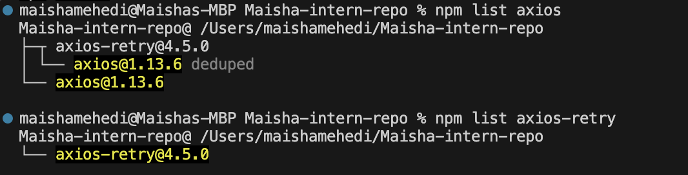
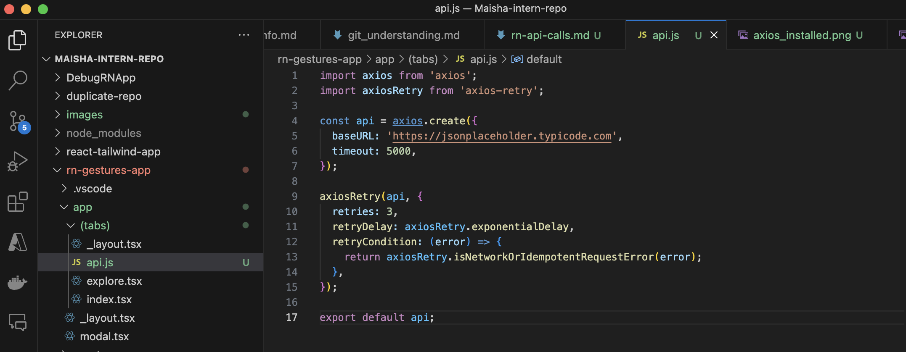
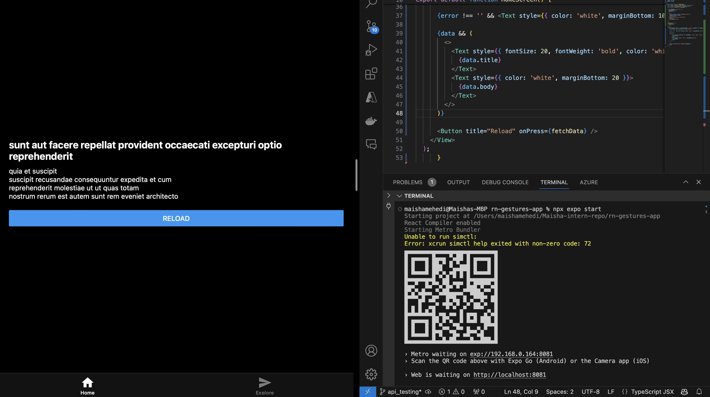

# Handling API Calls in React Native using Axios & Axios-Retry (22)

Task 

## Research how API calls work in React Native (fetch vs Axios)

First, I looked at the two main ways to make API calls in React Native:

### fetch
built into React Native
does not need installation
works for simple requests
needs more manual code for error handling and repeated setup

### axios
needs to be installed
cleaner syntax
easier to read
better error handling
supports timeout
works well with interceptors and retry logic

After my research I concluded for small basic requests, fetch is okay. But for an app like Focus Bear, where API calls may grow and need better structure, Axios makes more sense because it keeps the code cleaner and easier to manage.

## Install Axios and Axios-Retry

## Created the API setup file
I wanted one clean place to manage API logic instead of writing request settings again and again in different files.

## Implement API calls using Axios
In the index.tsx, instead of just calling an API and hoping it works, I handled loading, success, and failure properly.

## Use Axios-Retry to handle network failures

axiosRetry(api, {
  retries: 3,
  retryDelay: axiosRetry.exponentialDelay,
  retryCondition: (error) => {
    return axiosRetry.isNetworkOrIdempotentRequestError(error);
  },
});

- if a request fails because of a network issue
- Axios will retry it up to 3 times
- the wait time increases between retries
In a mobile app, internet is not always stable. A user may switch between Wi-Fi and mobile data, or have a weak connection. Retry logic helps the app recover from small temporary failures instead of failing right away

## Understand error handling

try {
  const response = await api.get('/posts/1');
  setPost(response.data);
} catch (err) {
  setError('Failed to load data');
} finally {
  setLoading(false);
}

- try runs the API call
- catch handles failure
- finally always runs, so loading stops even when the request fails
Handling an error is important as the app could get stuck on loading, crash, or show nothing to the user. 

## Understand response caching strategies

From my reasreach about response caching strategies, it means saving the last successful response so the app can still show something useful even if the internet fails later. In our case, I would ave important API responses locally, show cached data when the user is offline or refresh the data when internet comes back. Making the app more reliable. 

## Reflection 

### Why is Axios preferred over fetch in some cases?

Axios is preferred in some cases because it is easier to work with, especially as the app grows. It has cleaner syntax, supports timeouts, and makes error handling simpler. It also works well with interceptors and retry libraries, which makes it a better choice for apps that depend on APIs often.

### How does Axios-Retry improve network reliability?

Axios-Retry improves network reliability by retrying requests when a failure is temporary, such as a short network problem or weak connection. This helps the app recover from small issues without failing immediately. In a mobile app, this is useful because internet connections are often less stable than on desktop.

### How would you handle API failures gracefully in a React Native app?

I would handle API failures by showing a loading spinner while the request is running, then showing a clear error message if it fails. I would also give the user a retry button so they can try again without restarting the app. If the app depended heavily on API data, I would also consider caching the last successful response so the user can still see useful data when offline.
