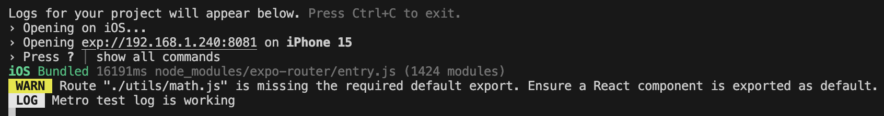
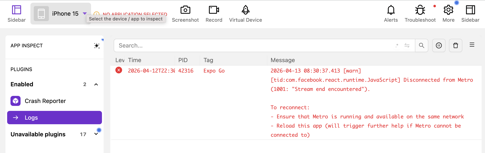
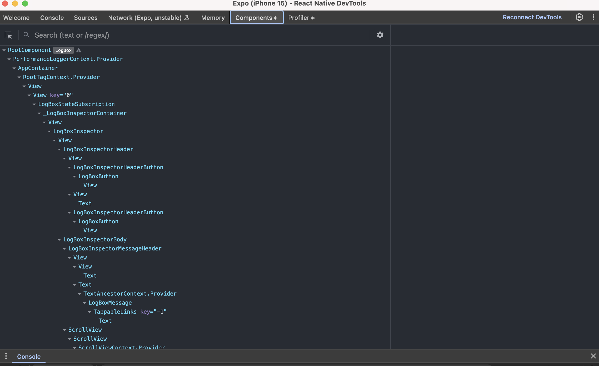
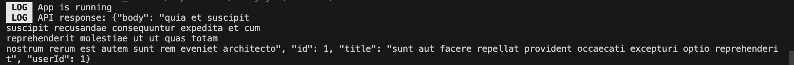
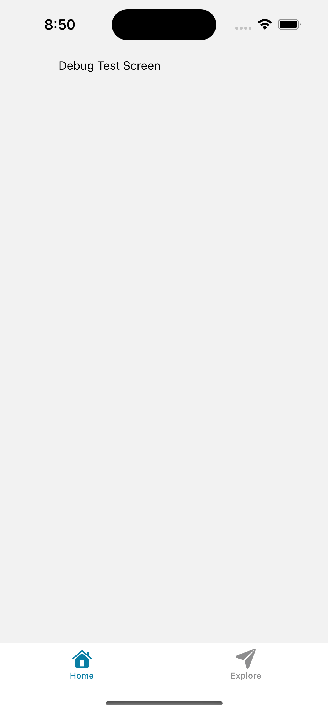

# Debugging React Native Apps

For this task, I learned how to debug a React Native app using Metro logs, Flipper, React Native DevTools, and network inspection. These tools help find and fix issues faster.

## Metro Logs

Metro is the first place I check when debugging. It shows console logs, warnings, and errors when the app is running. If something breaks, Metro usually tells me what went wrong and where.

---

## Flipper

I explored :contentReference[oaicite:0]{index=0} as a debugging tool. Flipper provides features like logs, layout inspection, and plugin-based debugging tools. However, my app did not connect to Flipper because I was using Expo Go, which does not fully support Flipper without a custom development build.

 Flipper connected to the React Native app showing debugging tools.

---

## React Native DevTools

React Native DevTools helped me inspect components, props, and state. I opened it using the Dev Menu or by pressing `j` in the terminal. This made it easier to understand how my UI is structured.

---

## Network Requests

To debug network requests, I checked API calls using logs and debugging tools. I looked at responses, errors, and status codes to understand if requests were working correctly.

---

## Reflection

Metro helps by showing real-time logs and errors, making it the fastest way to catch issues. 
Flipper provides more advanced tools like inspecting logs and app behavior. 
React Native DevTools makes it easy to inspect components and state. Network requests can be debugged by checking responses and errors using logs or tools like DevTools. Overall, these tools work together to make debugging easier and more efficient.