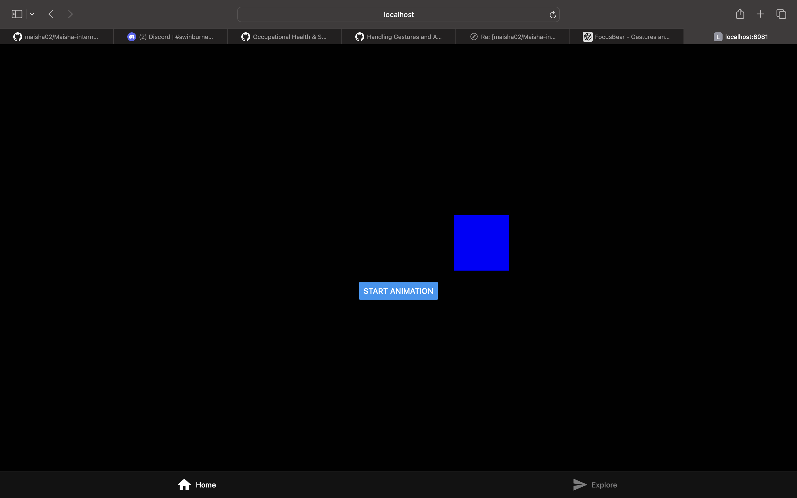
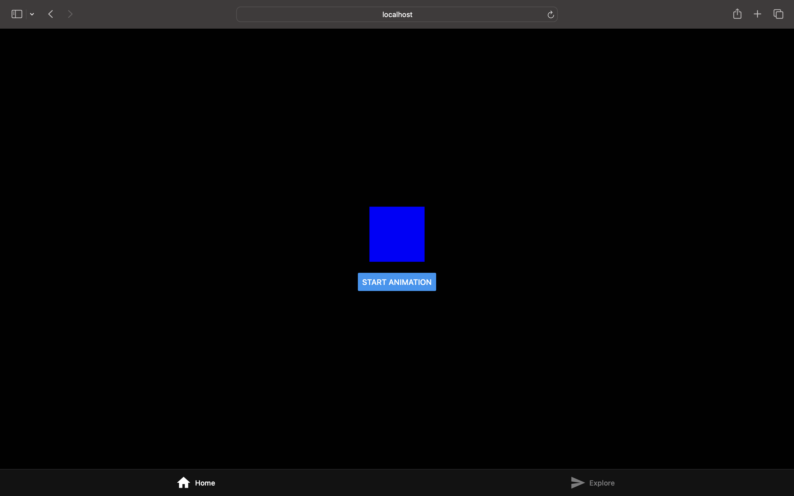

# Handling Gestures and Animations in React Native (#26)

# For the task
I created a simple annimation of a box that slides side by side. 

## What are the differences between Animated and react-native-reanimated?
Animated is built into React Native and is good for simple animations like fading or moving elements. react-native-reanimated is more advanced and runs animations on the UI thread, which makes it smoother for complex and gesture-based interactions.

## How does react-native-gesture-handler improve gesture performance?

It uses native touch handling instead of relying only on JavaScript, which reduces lag and makes gestures more responsive. It also handles complex gestures better and works well with Reanimated for smooth interactions.

## When would you use gestures instead of buttons in a UI?

Gestures are useful for natural actions like swiping, dragging, or long pressing. Buttons are better when actions need to be clear and easy to find, especially for new users.

## Why is InteractionManager.runAfterInteractions necessary?

It delays heavy tasks until after animations or user interactions finish, which helps keep the UI smooth. This prevents lag during transitions or gestures.
