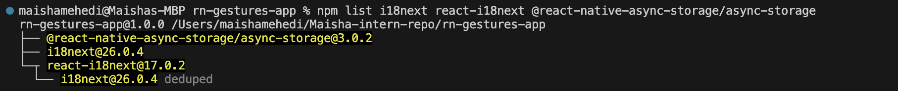
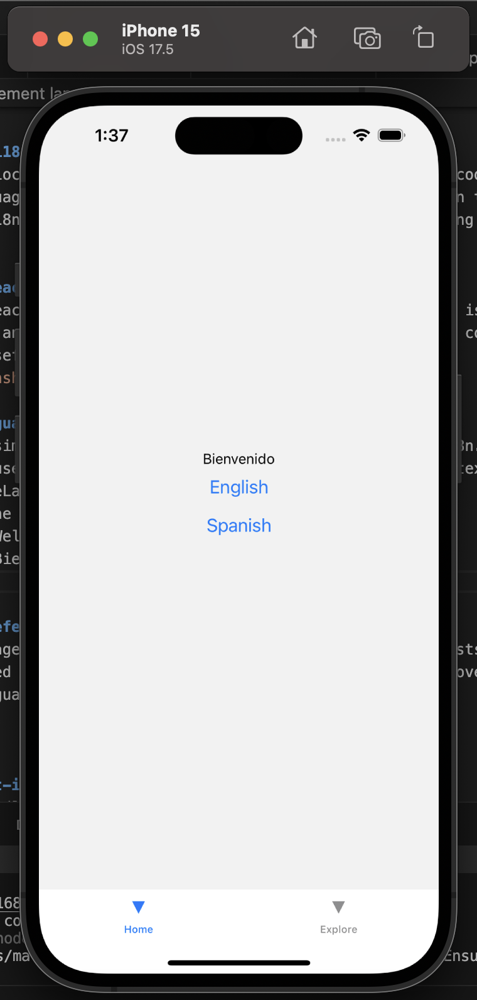
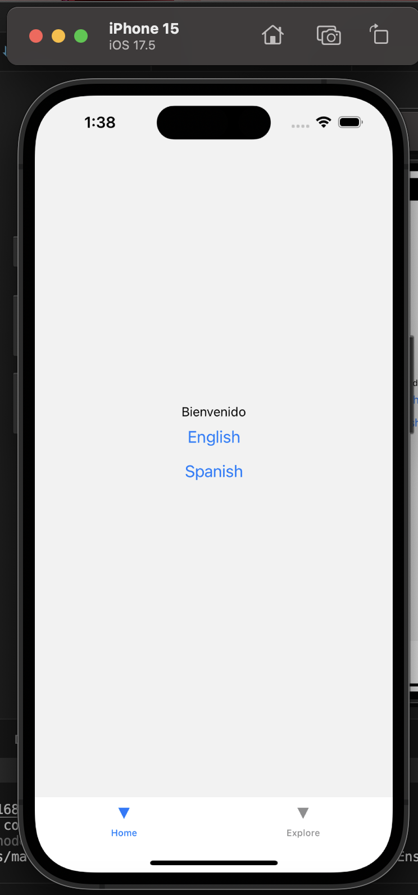

Implementing Localisation (i18n) with react-i18next #20

Tasks 

## Research how i18n works in React Native
Iresearched how localisation works in React Native. Instead of hardcoding text inside components, translations are stored in separate language files. The app then uses a translation function to display text based on the selected language. Libraries like i18next and react-i18next make this easier by handling translations, switching languages, and updating the UI automatically.

## Explore the react-i18next library
I explored the react-i18next library and learned that the main hook is useTranslation(). This hook gives access to t() for translations and i18n for language changes. The library updates components automatically when the language changes, which makes it useful for apps that support multiple languages.

## Implement language switching in a sample component
I implemented a simple language switcher in my app. I created an i18n.js file to store translations for English and Spanish. Then I used useTranslation() in my main screen to display text and added buttons to switch between languages using i18n.changeLanguage().
When I pressed the buttons:
English showed “Welcome”
Spanish showed “Bienvenido”

## Store user preferences for language selection
I used AsyncStorage to store the selected language so that it persists even after closing the app. When the app starts, it loads the saved language and applies it automatically. This improves user experience because users don’t need to select their language every time.

Reflections 

## How does react-i18next handle translations?
react-i18next handles translations by storing text in language resource files and using the t() function to display the correct text in components. It also allows dynamic language switching using i18n.changeLanguage(), which updates the UI instantly without reloading the app.

## What challenges arise when localising a React Native app?
One challenge is that different languages can change the layout of the app because text length varies. Some languages may require more space or different formatting. Another challenge is ensuring all text is translated properly and that no keys are missing. Managing user preferences and saving the selected language is also important.

## How would you test localisation support in an app?
I would test localisation by switching between languages and checking if all text updates correctly. I would also restart the app to confirm that the selected language is saved. Additionally, I would check different screens to make sure no text is missing or incorrectly displayed.