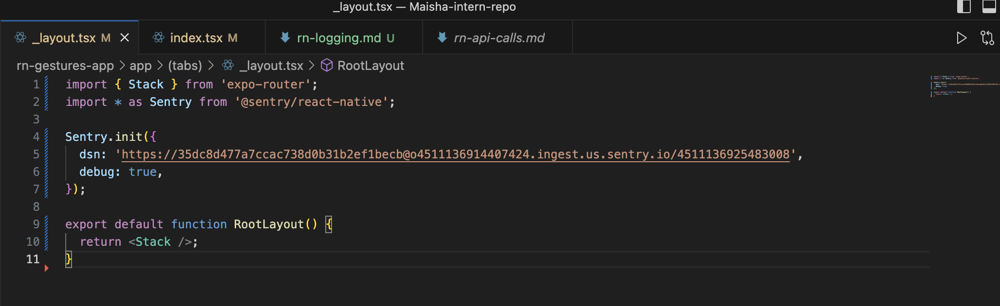
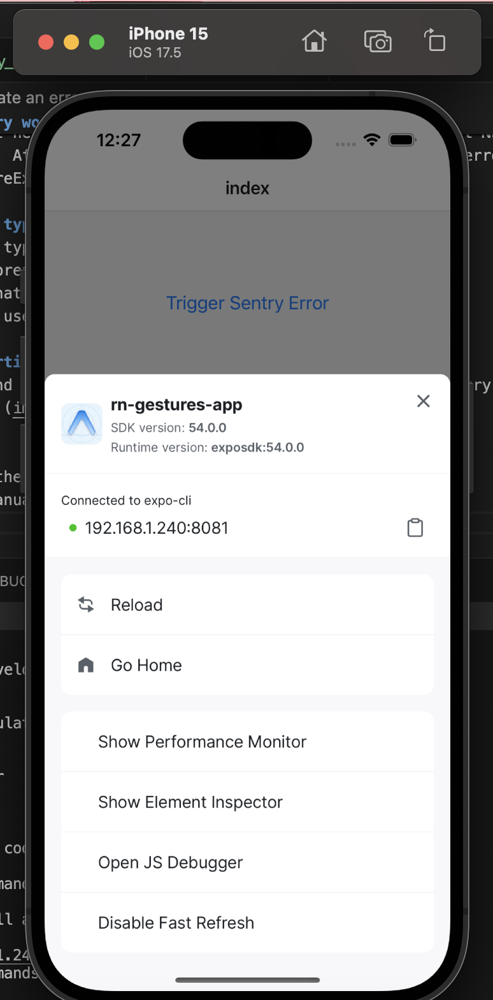
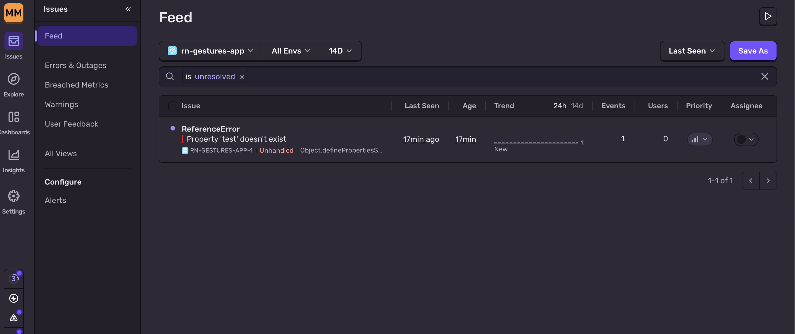

Logging and Crash Reporting with Sentry #18

Tasks
## Research how Sentry works in React Native
Sentry is a tool that helps track errors and crashes in an app. In React Native, it is added using the @sentry/react-native package. After setup, it automatically captures unhandled errors and also allows manual logging using functions like captureException.

## Explore different types of logs
There are three main types of logs:
Errors: Issues that break the app
Warnings: Problems that do not fully break the app
Debug logs: Messages used during development to track behaviour

## Set up error reporting
I installed Sentry and initialized it in my app using the DNS from sentury.

## Simulate an error
I added a button in the app to trigger a test error. 
  throw new Error("Manual Sentry test error");

## Verify error in Sentry
After running the app and triggering the error, I checked the Sentry dashboard and confirmed that the error was logged.

Reflection
## Why is logging important in a production React Native app?
Logging is important because it helps developers understand what is happening in the app after it is released. Users may face issues that cannot be easily reproduced, so logs help identify and fix those problems.

## How does Sentry improve debugging and issue tracking?
Sentry improves debugging by collecting errors in one place and showing useful details like error type, time, and stack trace. It also tracks how often an issue happens, which helps prioritise bugs.

## What are best practices for handling and logging errors?
Do not log sensitive information (e.g., passwords)
Log meaningful errors instead of too many logs
Capture handled errors when needed
Use tools like Sentry to monitor issues in real time