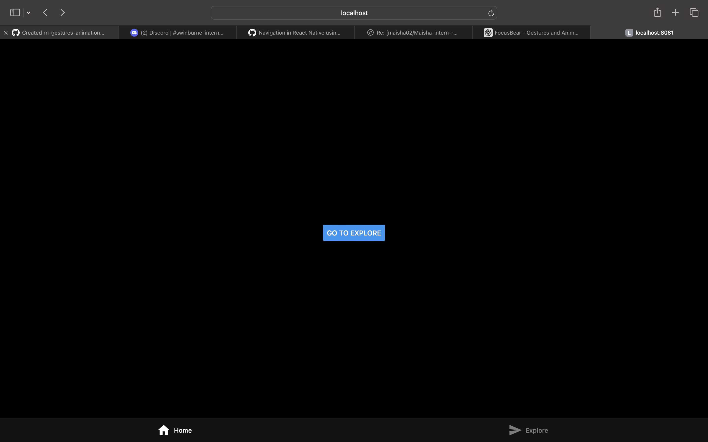

# Navigation in React Native using React Navigation (#27)

# Task 
For this task I created two pages basically, home and explore, by clicking on the button the user can go back and forth. 

## What are the key differences between stack, tab, and drawer navigation?
Stack navigation is used when screens open one after another, like moving from Home to Details. Tab navigation is used to switch between major sections with a tab bar, while drawer navigation uses a side menu for navigation.

## How does React Navigation handle screen transitions?
React Navigation keeps track of the current screen and updates the navigation state when the user moves between screens. In stack-based navigation, it also provides back navigation and transition effects between screens.

## How would you implement deep linking in a React Native app?
I would set up a linking configuration that maps URLs to specific screens in the app. This allows the app to open the correct screen directly when a user taps a matching link.