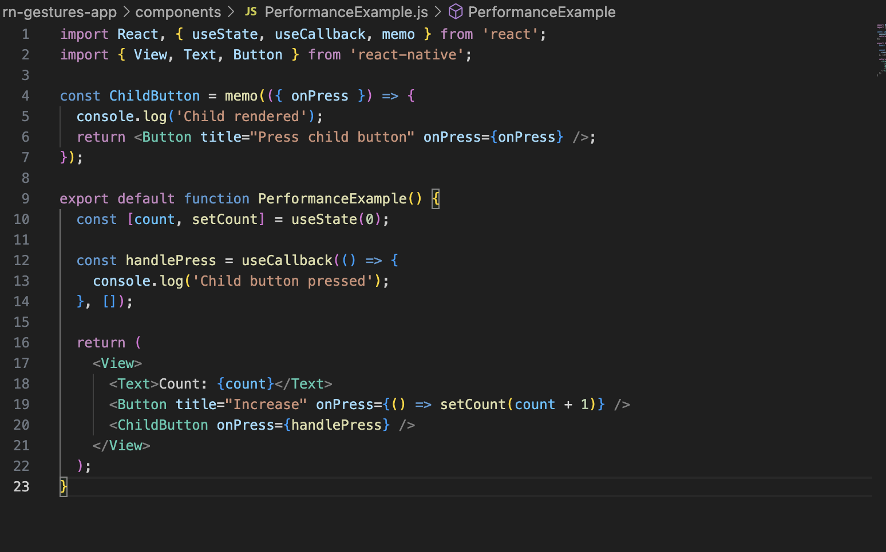
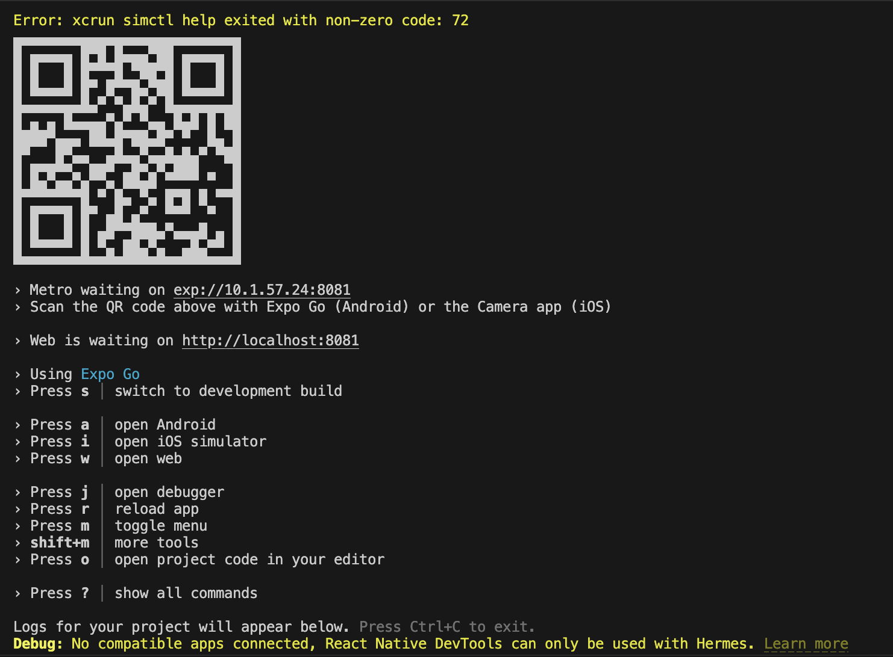

# Performance Optimization in React Native (24)

# Task 

## Research common React Native performance bottlenecks
After researching about common React Native performance bottlenecks, we can say Common performance issues in React Native include unnecessary re-renders, large lists, heavy images, and too many state updates. These leads to the app feel slow or laggy.

## Optimize rendering using useMemo, useCallback, and React.memo
I created a simple example using "useCallback" and "React.memo". These help reduce unnecessary "re-renders" when the parent component updates. "useMemo" is also used to save expensive calculated values between renders.

## Understand how React Native handles memory and garbage collection
React Native uses JavaScript memory management and garbage collection. Unused objects are removed automatically, but poor cleanup can still cause memory problems. This is why listeners, timers, and heavy data should be managed carefully.

## Investigate performance monitoring tools for React Native
I looked at tools used to monitor React Native performance. Useful tools include React Native DevTools, Profiler, Memory tab, and Perf Monitor. These tools help find slow renders, memory issues, and dropped frame problems.

# Reflection answers
## What are the most common performance issues in React Native?
The most common issues are unnecessary re-renders, large lists, slow JavaScript work, and dropped frames. These issues can make the app feel slow and less responsive.

## How do useMemo and useCallback improve performance?
useMemo stores calculated values, and useCallback stores functions between renders.This helps reduce repeated work and unnecessary re-rendering.

## What tools can you use to measure and monitor app performance?
We can use React Native DevTools, the Profiler tab, the Memory tab, and Perf Monitor. These tools help inspect rendering, JavaScript performance, and memory usage.