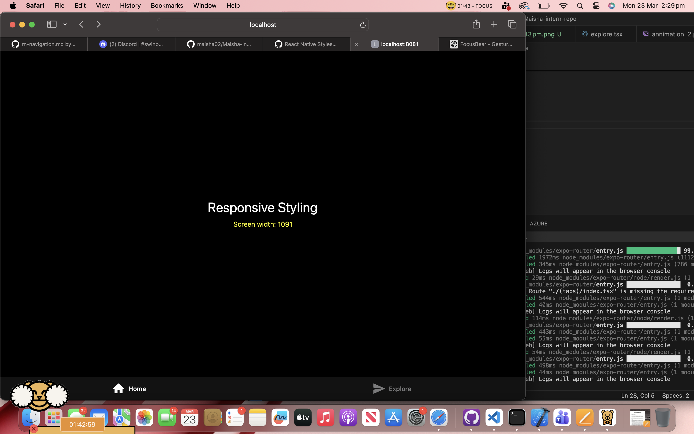

# React Native Stylesheets vs CSS-in-JS (#28)

# Task

## Why does React Native use camelCase instead of traditional CSS properties?
React Native styles are written as JavaScript objects, not standard CSS files. Because of this, it uses camelCase names like backgroundColor instead of background-color.

## What are the benefits of using StyleSheet.create() over inline styles?
StyleSheet.create() keeps styles cleaner, easier to reuse, and more organized. Inline styles are useful for small changes, but they can become messy in larger components.

## How would you handle different screen sizes in React Native?
I would use flexible layouts with flex, percentages, and tools like useWindowDimensions or Dimensions. This helps the layout adjust to different screen sizes.