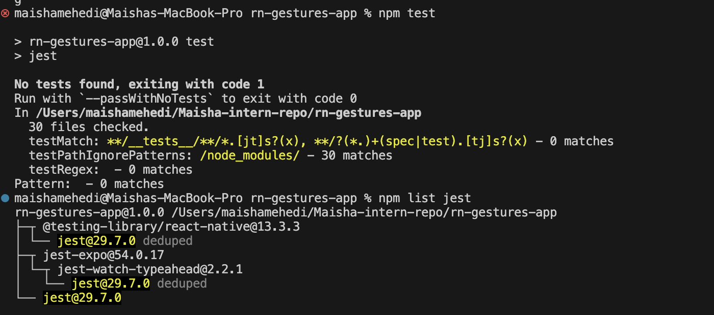
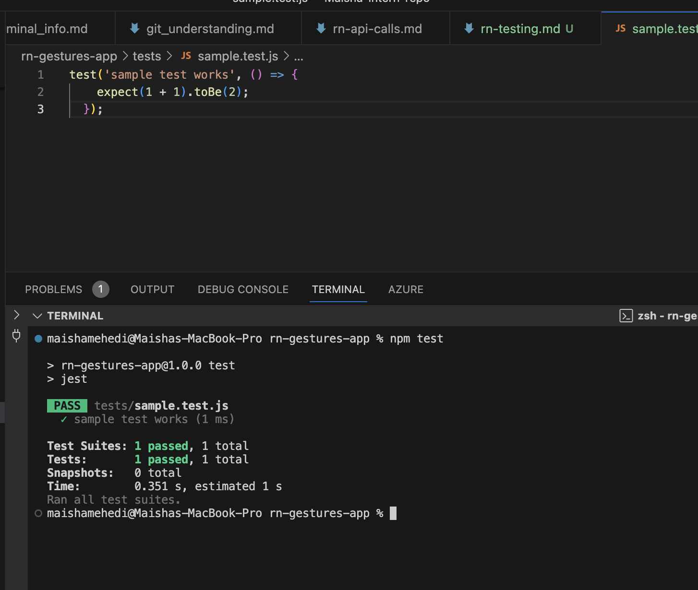
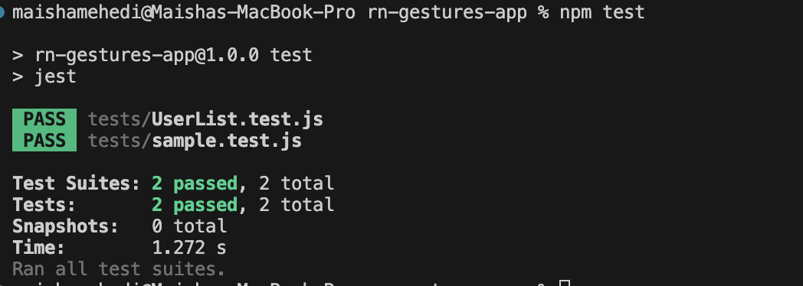

# Writing Unit and Integration Tests for React Native (23)

# Task 

## Research the difference between unit, integration, and end-to-end testing
After reading and reaserching about these topics, in short we can conclude:-
Unit testing checks a small part of the app like one component.
Integration testing checks how multiple parts work together.
End-to-end testing checks the full app flow like a real user.

## Set up Jest and React Native Testing Library
I installed Jest and React Native Testing Library in my rn-gestures-app project.
Then I added the Jest configuration and test script in package.json.
When I ran npm test, Jest worked and showed that no test files had been created yet.

## Create a simple test
I created a test file inside the tests folder and wrote a simple test.
The test checks a basic condition to confirm Jest is working.
After running npm test, the test passed successfully.

## Mock API + test data fetching
I created a component that fetches data from an API.
In the test, I mocked the API using jest.fn() to avoid real requests.
Then I checked that the fetched data is displayed correctly.

# Reflection

## Why is testing important in React Native development?
Testing helps find bugs early and keeps features working after changes.Overall it makes the app more stable and reliable.

## How do you mock API calls in tests?
We replace the real API call with a fake one using jest.fn(), this lets you return test data without using the internet.

## What’s the difference between unit and integration tests?
Unit tests check one small part like a component. Integration tests check how multiple parts work together.
