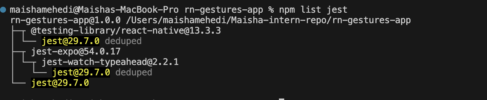
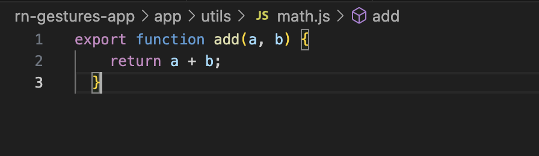
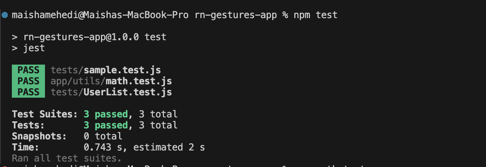
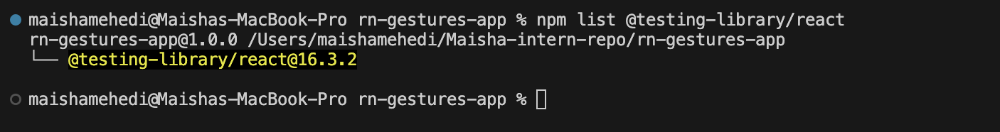
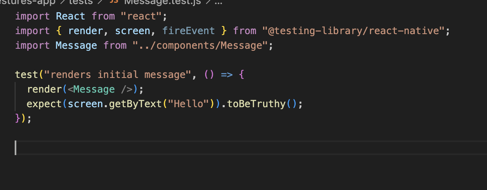
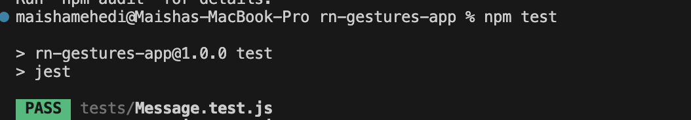
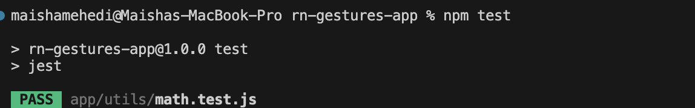

# Introduction to Unit Testing with Jest (69)
 
# Task

## Research about Jest
Jest is a JavaScript testing framework used to test React applications. It helps developers check if their code works correctly by running automated tests. Unit testing focuses on testing small parts of the code, such as functions, to make sure they behave as expected. This is important because it helps catch bugs early and ensures that new updates do not break existing features.

## Setup Jest

Checked for jest using the command npm list jest.

## Create a Utility Function
For this task, I created a math.js file and added a function.

## Jest Test 
Created a test file math.test.js. Then ran the test using the command "npm test"

# Reflection 

## Why is automated testing important in software development?
Automated testing helps make sure the code works correctly. It helps find bugs early and prevents breaking existing features when changes are made. It also saves time during development.

## What did you find challenging when writing your first Jest test?
At first, it was a bit confusing to understand how test and expect work. It also took some time to understand how to connect the test file with the function. After trying once, it became easier.

------

# Testing React Components with Jest & React Testing Library (70)

# Task 

## Research how React Testing Library works with Jest
React Testing Library is used with Jest to test React components. It focuses on testing how users interact with the UI instead of testing internal code. This makes tests more reliable and closer to real user behavior.

## Check for React Testing Library
I checked for  React Testing Library using the command  npm list @testing-library/react. 

## Write Test (Render Test)
Firstly created a message.js component, then created a test file to check for rendering. 

test("renders initial message", () => {
  render(<Message />);
  expect(screen.getByText("Hello")).toBeTruthy();
});

## Adding a user interaction
For this part I added a small section for the button in the Message.test.js file 

test("changes text when button is clicked", () => {
  render(<Message />);
  fireEvent.press(screen.getByText("Click Me"));
  expect(screen.getByText("Button Clicked")).toBeTruthy();
});

# Reflection 

## What are the benefits of using React Testing Library instead of testing implementation details?
React Testing Library focuses on how users interact with the UI. This makes tests more realistic and less likely to break when the internal code changes.

## What challenges did you encounter when simulating user interaction?
It was a bit confusing to understand how to simulate clicks and select elements. It took some time to learn how fireEvent works, but it became easier after trying it.

---------