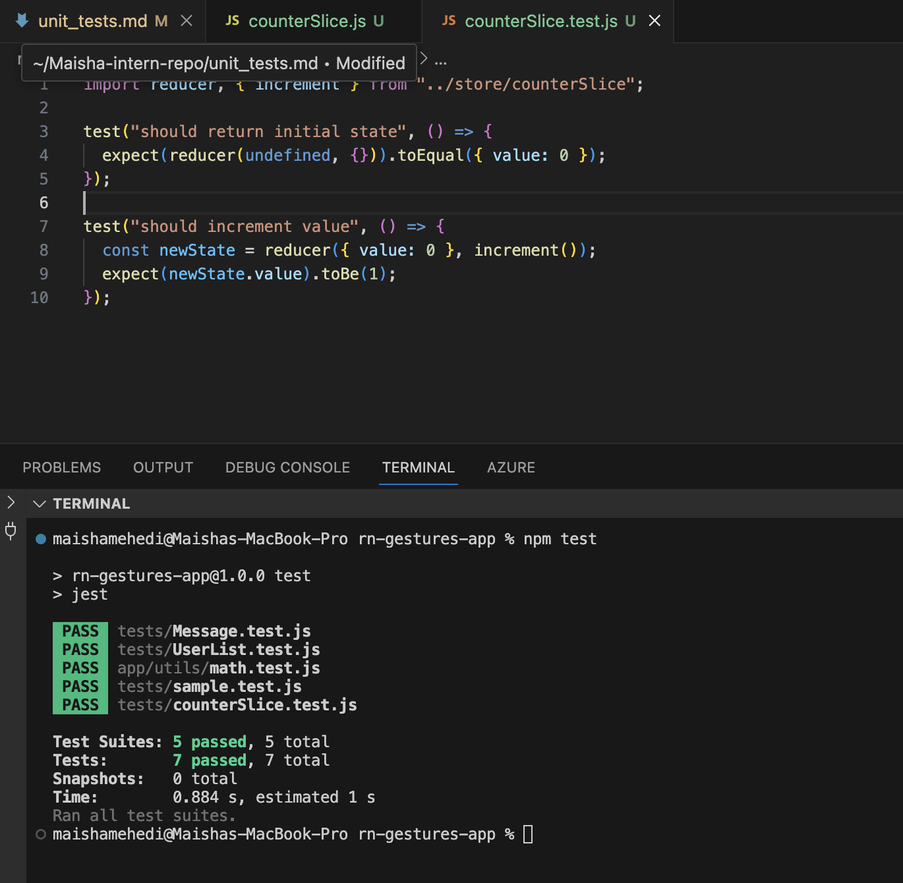

# Introduction to Unit Testing with Jest (69)
 
# Task

## Research about Jest
Jest is a JavaScript testing framework used to test React applications. It helps developers check if their code works correctly by running automated tests. Unit testing focuses on testing small parts of the code, such as functions, to make sure they behave as expected. This is important because it helps catch bugs early and ensures that new updates do not break existing features.

## Setup Jest

Checked for jest using the command npm list jest.

## Create a Utility Function
For this task, I created a math.js file and added a function.

## Jest Test 
Created a test file math.test.js. Then ran the test using the command "npm test"

# Reflection 

## Why is automated testing important in software development?
Automated testing helps make sure the code works correctly. It helps find bugs early and prevents breaking existing features when changes are made. It also saves time during development.

## What did you find challenging when writing your first Jest test?
At first, it was a bit confusing to understand how test and expect work. It also took some time to understand how to connect the test file with the function. After trying once, it became easier.

------

# Testing React Components with Jest & React Testing Library (70)

# Task 

## Research how React Testing Library works with Jest
React Testing Library is used with Jest to test React components. It focuses on testing how users interact with the UI instead of testing internal code. This makes tests more reliable and closer to real user behavior.

## Check for React Testing Library
I checked for  React Testing Library using the command  npm list @testing-library/react. 

## Write Test (Render Test)
Firstly created a message.js component, then created a test file to check for rendering. 

test("renders initial message", () => {
  render(<Message />);
  expect(screen.getByText("Hello")).toBeTruthy();
});

## Adding a user interaction
For this part I added a small section for the button in the Message.test.js file 

test("changes text when button is clicked", () => {
  render(<Message />);
  fireEvent.press(screen.getByText("Click Me"));
  expect(screen.getByText("Button Clicked")).toBeTruthy();
});

# Reflection 

## What are the benefits of using React Testing Library instead of testing implementation details?
React Testing Library focuses on how users interact with the UI. This makes tests more realistic and less likely to break when the internal code changes.

## What challenges did you encounter when simulating user interaction?
It was a bit confusing to understand how to simulate clicks and select elements. It took some time to learn how fireEvent works, but it became easier after trying it.

---------

# Mocking API Calls in Jest (71)

# Task 
## Research how to mock API calls in Jest using jest.fn() and jest.mock().
Jest allows mocking API calls using functions like jest.fn() and jest.mock(). This helps simulate API responses without making real network requests. It allows testing how components behave with different data.

## Create Component (API Fetch) and Mock API in Test
Created a component called "UserList" that fetches user data and displays it.
Then Mocked the API call and tested if the component shows the correct data.
And finally run the tet, to check if the test has passed.

# Reflection 
## Why is it important to mock API calls in tests?
Mocking API calls allows testing without real network requests. It makes tests faster and more reliable, and avoids dependency on external services.

## What are some common pitfalls when testing asynchronous code?
It can be difficult to handle timing correctly. Sometimes tests fail if the data has not loaded yet. Using functions like waitFor helps fix this.

---------

Testing Redux with Jest (72)

# Test 

## Research how to test Redux reducers and actions in Jest
Redux tests check whether reducers and actions update the state correctly. In Jest, reducers are tested by giving them a starting state and an action, then checking the returned state. Async Redux actions can also be tested to make sure they handle loading and data properly.

## Simple Redux Slice
Created a Redux slice with normal actions and one async action in the file counterSlice.js
Afterwards wrote test to check if Redux reducer updates the counter state correctly. The screenshot below shows the test passed. 

## Async Redux Action
For this part we added this bit of code to counterSlice.js

export const incrementAsync = () => {
  return async (dispatch) => {
    dispatch(increment());
  };
};

And then test with this 

test("should dispatch incrementAsync", async () => {
  const dispatch = jest.fn();

  await incrementAsync()(dispatch);

  expect(dispatch).toHaveBeenCalledWith(increment());
});

The async test first failed because the dispatch happened inside setTimeout. I simplified the async action and used await in the test so Jest could detect the dispatch correctly.

# Reflection 
## What was the most challenging part of testing Redux?
The most challenging part was understanding how to test the async action. At first, the test failed because the dispatch was not called at the expected time. After simplifying the async function and using await, it became easier to test.

## How do Redux tests differ from React component tests?
Redux tests focus on how the state changes after actions are dispatched. React component tests focus on what is shown on the screen and how users interact with it.